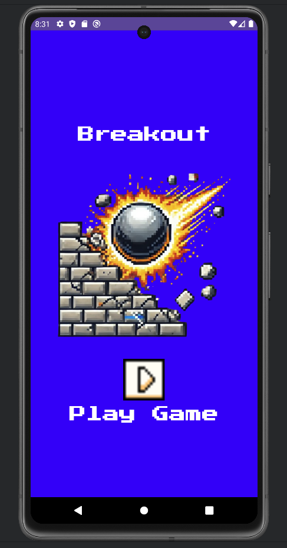
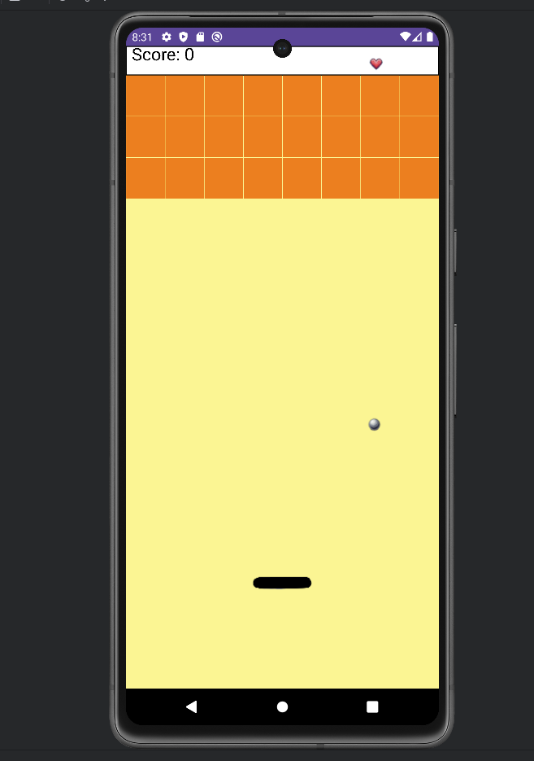
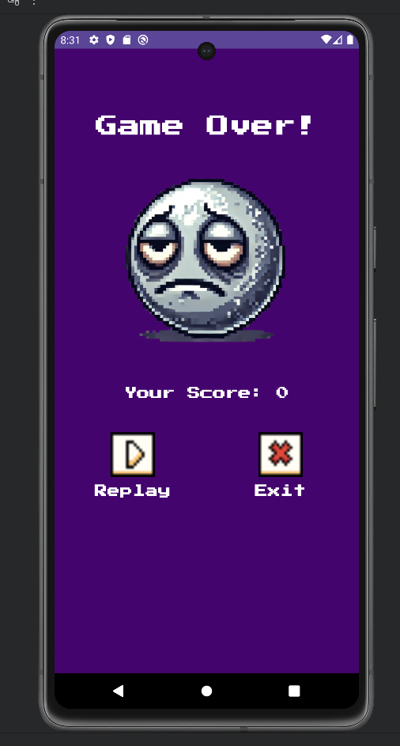
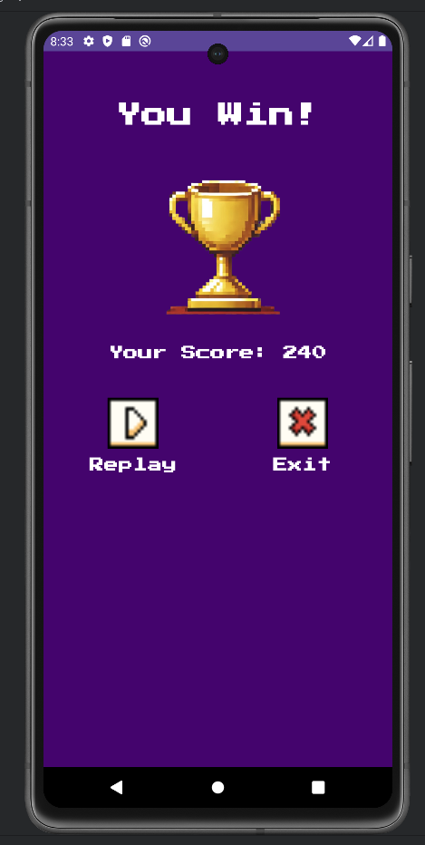

# BreakoutGameKotlin
Projeto do curso de Pós Gradução da PUCPR - Desenvolvimento de Aplicativos Móveis: Desenvolvimento Mobile Avançado

## Descrição:
A aplicação desenvolvida para Andorid que atende na finalidade de replicar o game desenvolvido originalmente para o Atari, Breakout.

## Motivo da aplicação:
Breakout é um jogo de arcade desenvolvido e lançado pela Atari em 1976. Inspirado no clássico Pong, ele foi criado por Nolan Bushnell e Steve Bristow e teve participação de Steve Wozniak e Steve Jobs na sua construção. O jogo é considerado um dos pioneiros no estilo "bloco de quebra" (brick-breaking), onde o jogador controla uma plataforma horizontal para rebater uma bola que quebra blocos no topo da tela. Em Breakout, o jogador controla uma barra (ou "paddle") na parte inferior da tela, movendo-a para a esquerda e para a direita para rebater uma bola em direção aos blocos empilhados na parte superior. Cada bloco que é atingido pela bola desaparece, e o objetivo é destruir todos os blocos para avançar de nível. Quando a bola escapa pela parte inferior da tela, o jogador perde uma vida, e o jogo termina quando todas as vidas acabam.

## Informações Técnicas:
A aplicação foi desenvolvida com a linguagem Kotlin, para dispositivos Android.

## Tecnologias usadas:
- Kotlin: https://kotlinlang.org/docs/getting-started.html
- Android Strudio: https://developer.android.com/studio/intro?hl=pt-br

## Imagens:

  
  
  
  

### Autor:
- Alfredo Paes da Luz.
